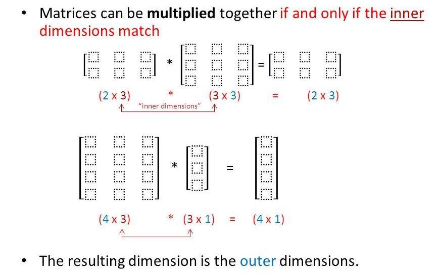
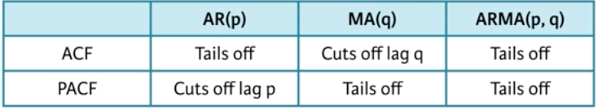

I set my knitr functions. 
```{r}
### Knitr options
knitr::opts_chunk$set(warning=FALSE,
                     message=FALSE,
                     fig.align="center"
                     )

options(warn=-1) # Hides all warnings, as the knitr options only work on local R-Markdown mode. 
```

I load my packages. 
```{r}
library(rmarkdown) # formatting
library(tidyverse) # basic operations and plots
library(eurostat) # data used for examples
library(astsa)
library(xts)
```


# Intro

The purpose of these notes is to form all prerequisites for the course Advanced econometrics. Below is the complete list:

* Order conditions 1th, 2th, 3th. 
* Linear algebra
* Eigenvalues and eigenvectors
* Polynial (unity circle)

# Tips and tricks for markdown

Links:
<http://www.rstudio.com> [link](www.rstudio.com)

Internal doc links: Jump to [Header 1](#anchor)

* unordered list 
  + sub-item 1 
  + sub-item 2
    - sub-sub-item 1
* item 2
Continued (indent 4 spaces)

1. ordered list 2. item 2
i) sub-item 1
A. sub-sub-item 1

(@) A list whose numbering 
continues after
(@) an interruption

Common text commands:
Alt+i: |
Alt+=: ≠

*Text italic style*
**Text bold style**
_Text italic_
__Text bold__

In line code: 
`x<-10` 

# Linear algebra

The info is based on:

Datacamp kursus: https://campus.datacamp.com/courses/linear-algebra-for-data-science-in-r/matrix-vector-equations?ex=15 

khanacademy: https://www.khanacademy.org/math/precalculus/precalc-matrices/representing-systems-with-matrices/a/representing-systems-with-matrices?modal=1

matrixkursus: http://chortle.ccsu.edu/vectorlessons/vmch13/vmch13_19.html 

Dansk r/matrix kursus: https://www.math.uh.edu/~jmorgan/Math6397/day13/LinearAlgebraR-Handout.pdf

Youtube channel series on linear algebra: https://www.youtube.com/watch?v=kjBOesZCoqc&t=1s

## Vectors

Vectors can be seen as a list of numbers, a direction(arrow) in space. 

In linear algebra the vectors are always rooted in the origin. Origin is the center of space(axis). 

In a vector the 1. value is the movement in the (x) axis, 2. value is the movement in the (y) axis, the 3. value is the movement in the (z) axis and ect. for more dimensions.  

$\begin{bmatrix} -2 \\ 3 \end{bmatrix}$

Positive values are a movement to the right and negatives a movement to the left for x-values. For y positive is up, and negative is down. 

The sum of 2 vectors, is to add them together. As vectors can be interpreted as movents, we add the 2 movements together. 

$\begin{bmatrix} 1 \\ 2 \end{bmatrix}+ \begin{bmatrix} 3 \\ -1 \end{bmatrix} = \begin{bmatrix} 4 \\ 1 \end{bmatrix}$

As you can see from above we just add the numbers in the same dimensions together. 

Vectors can also be multiplied by a number/scalar. Here we just scale/stretch the vector by a number. For a negative, we flip it and then scale it. 

$2 \begin{bmatrix} 1 \\ 2 \end{bmatrix}= \begin{bmatrix} 2 \\ 4 \end{bmatrix}$

### Basis vectors:
It can be nice to think about vector values as scalars stretching out the **basis vectors**. With $\hat{i}$ being the basis vector for the **x axis** having the value +1 pointing right, and $\hat{j}$ being the basis cector for the **y axis** having the value +1 pointing up. This implies that we can choose different basis vectors and thereby creating different coordinate systems. When we describe vectors numerically, we implicitly assume some coordinate system. 

The **span** of two(in 2D) given pairs of vectors, is the set of all their linear combinations. If both pairs of vectors can move, every point in the coordinat system can be reached (span is the whole space). If both vectors are pointing in the same direction it becomes 1 line. If both vectors are in the center it becomes a point. If we fix one scalar, then the other one can only move in a straight line. In these cases where 1 vectors is redundant eg. does not affect **span**, we say it's **linearly dependent**. The vector can then be expressed as a linear combination of the other vector. If the vector is not redundant, then we say it's **linearly independent**. 

When dealing with a lot of vectors it can be usefull to imagine the vectors as a point which is the end/tip of the vector. Instead of a line from the origin. 

## Linear transformation
Transformation can here be understood as function (takes input and gives output). In this way the transformation moves the input vector to the output vector, which it does by moving all of space around. Linear transformations can turn and stretch space out, but must keep origin in place, and grid lines parralel and equally spaced. Matrix vector equation can generally be written as: (Ax = B).

To transform space and get information about how every object is transformed, we only need information about how the basis vectors are transformed. 

Consider the vectors:
$\overrightarrow{v} = -1 \hat{i} + 2 \hat{j}$

Then after transforming. V will land $-1$ times where $\hat{i}$ landed, plus $2$ times where $\hat{j}$ landed. 

For this transformation $\hat{i}$ landed at $\begin{bmatrix} 1 \\ -2 \end{bmatrix}$ and $\hat{j}$ landed at $\begin{bmatrix} 3 \\ 0 \end{bmatrix}$. 

This means that $\overrightarrow{v}$ lands at:

$-1 \begin{bmatrix} 1 \\ -2 \end{bmatrix} +2 \begin{bmatrix} 3 \\ 0 \end{bmatrix} = \begin{bmatrix} -1(1)+2(3) \\ -1(-2)+2(0) \end{bmatrix} = \begin{bmatrix} 5 \\ 2 \end{bmatrix}$.

In general we can write:

$x \begin{bmatrix} a \\ c \end{bmatrix} + y \begin{bmatrix} b \\ d \end{bmatrix} = \begin{bmatrix} ax + by \\ cx + dy \end{bmatrix}$

Calculating this in R:
```{r}
i_hat <- c(1,-2) #Coordinates for where i hat lands. 
j_hat <- c(3,0) #Coordinates for where j hat lands. 
x <- -1 
y <- 2
result <- x*i_hat+y*j_hat
result
```

The $\hat{i}$ and $\hat{j}$ can be interpreted as a 2x2 matrix describing a linear transformation. Then if you are given a vector as in this case $\begin{bmatrix} -1x \\ 2y \end{bmatrix}$, then you can use the above calculation to find where it lands. Below is 2 other examples of transformations with the same vector. 

90 degree rotation counter clockwise transformation. 
```{r}
i_hat <- c(0,1) #Coordinates for where i hat lands. 
j_hat <- c(-1,0) #Coordinates for where j hat lands. 
x <- -1 
y <- 2
result <- x*i_hat+y*j_hat
result
```

Shear transformation. 
```{r}
i_hat <- c(1,0) #Coordinates for where i hat lands. 
j_hat <- c(1,1) #Coordinates for where j hat lands. 
x <- -1 
y <- 2
result <- x*i_hat+y*j_hat
result
```

## What is a matrix?
Matrix can be seen as a storage of data. The matrix can be seen as a linear transformation aka. changing existing vectors, objects ect. Mutipliying a matrix with a vector, is what it means to apply the transformation to that vector. 

Matrix have rows and columns. Is written in the following form:
rows x columns.

Each number is called a element and have a specific location. 

Matrix: 
$A_{m,n} = \begin{pmatrix} a_{1,1} & a_{1,2} & \cdots & a_{1,n} \\ a_{2,1} & a_{2,2} & \cdots & a_{2,n} \\ \vdots  & \vdots  & \ddots & \vdots  \\ a_{m,1} & a_{m,2} & \cdots & a_{m,n} \end{pmatrix}$

Column matrix/vector: (M x 1). Consist of a single column of "M" elements. 
Row matrix/vector (1 x M). Consist of a single row of "M" elements. 

### Matrix multiplication
Often time we want to describe the affects of several matrixes (linear transformations). The overall effect is another new linear transformation distinct from the initial transformations, so that it is one action. This is called **composition**. When taking the product of several matrixes, do it from the right to left, as the order matter. We can think of this as the columns of the right matrix to be the initial location of the basis vectors, and then apply the transformation of the left matrix. Then it's really just several vectors mulitplied by a matrix. 

Matrixes can be multiplied together if: 
The inner dimensions match: ex. 2x3 times 3x3, or 4x3 times 3x1. 
The dimensions then become the outher dimensions: ex. 2x3, or 4x1.

Explained in the below image:
 
This is also another example on why the order matter when you multiply it. 

I define 2 matrixes and then i multiply them. 
```{r}
Vector1 <- c(1,-2,0,4) # define vector
A <- matrix(Vector1, 2,2, byrow = TRUE) # make matrix

Vector2 <- c(3,-4,1,0) # define vector
B <- matrix(Vector2, 2,2, byrow = TRUE) # make matrix
# Matrix multiplication

A%*%B
```

In 3D we in addition have the z dimension and the basis vector is called $\hat{k}$. Here a 3x3 matrix describes the linear transformation, where each column describes the transformation of each basis vector. 

### The determinant
The determinant is how much the "area" is scaled(increases in size) by the linear transformation. We can think of this area of the basis vector, but it really describes the factor whereby all of space is scaled. This is called the **determinant** "det". 

The **determinant** increases space if it's bigger than 1. If it's less than 1, then it shrinks the area. If it is 0, if it shrinks all of the area into a line or a single point. If it is negative then i flips all of space, but the absolute value still tells how much space has increased in size. We can interpret the flip as the basis vectors having opposite positions to each other, compared to normal. 

In 3D we can think of the determinant as telling how much the volume is being scaled. 

$det(\begin{bmatrix} a & b \\ c & d \end{bmatrix}) = ad - bc$

If we assume "b" and "c" to be 0. We can understand this as "a" being how much $\hat{i}$ is being stretched in the x-direction, and "d" tells how much $\hat{j}$ is being stretched in the y-direction. Then it's just multiplying a times d. If only one of b or c is 0, the determinant is still the same, but the area is just stretched to not be a rectangle, but instead a parallelogram. If both b and c takes values, it roughly tells how much the paralellogram is stretched in the diagonal direction. 

$\begin{bmatrix} a & b \\ c & d \end{bmatrix}$

### Linear system of equations

Here we have a linear system of equations. Here we line up variables, we add 0 if there is no variable in that equation. We have all the constants on the right side. 
$\begin{bmatrix} 2x + 5y + 3z = -3 \\ 4x + 0y + 8z = 0 \\ 1x + 3y + 0z = 2 \end{bmatrix} \Rightarrow \begin{bmatrix} 2 & 5 & 3 \\ 4 & 0 & 8 \\ 1 & 3 & 0 \end{bmatrix} \begin{bmatrix} x \\ y \\ z \end{bmatrix} = \begin{bmatrix} -3 \\ 0 \\ 2 \end{bmatrix}$

We can also formally denote this:

$A \overrightarrow{x} = \overrightarrow{v}$

We can understand this as we are looking for a vector as, that after applying the matrix/linear transformation A lands on the vector v.

### Inverse matrixes

If the determinant is non-zero, there will only be one vector x that lands on the vector v. When you show the linear transformation in reverse, this is the inverse linear transformation. The property of the inverse is that you apply it after the transformation, then you are back to the initial start, and you have done nothing. 

The linear transformation that is doing nothing is called the identity matrix. 

$A^{-1}A = I = \begin{bmatrix} 1 & 0 \\ 0 & 1 \end{bmatrix}$

### Solving the system of equations. 

We can solve our equation $A \overrightarrow{x} = \overrightarrow{v}$ by first finding the inverse and then applying it to both sides in the equation. 

$\overrightarrow{x} = A^{-1} \overrightarrow{v}$

Now we have isolated the vector x which we wanna find. 

Typically if we have as many equations as unknowns, then there is one solution. If we have more equations than unknowns, then one equation should be abundant so we can combine them to solve. 

Property to ensure a unique solution: 
The matrix A must have an inverse (except, a few rare cases).
The determinant of A is nonzero. 
The rows and colums of A form a basis for the set of all vectors with n elements (something to do with basis vectors have a unique solution).

Example calculating in R: 
```{r}
A
Ainv <- solve(A) # solving finds the inverse if it exists (can only be sqaure matrixes, but not all), are unique. 
Ainv
Ainv %*% A # Invirse A times A is the I(identity) matrix. 

det(A) # finding the determinant
```

No solution(inconsistent): Visualized by 2 lines being parallel. 
1 solution(consistent): Visualized by 2 lines intersecting one time. 
Infinit solutions: Visualized by 2 lines being the same, therefore intersecting infinitly. 

### Rank and column space
If the output of a transformation is a line it's rank 1. If it's a plane it's rank 2. If it's a 3D space, it's rank 3. So rank is the number of dimensions. Set set of all possible outputs is called the column space. If the number of dimensions is equal to the number of columns in the matrix, we call it full rank. 

### Non-square matrixes

Example: A 3 x 2 matrix (3 rows, 2 columns), can be interpreted as a 2D plane slicing through a 3 space. It's full rank, as the number of dimensions is equal to the number of columns in the matrix. The input is 2D and the output is 3D. There can be many such matrixes/transformations. 


Some options for non-square matrices:
Row reduction (by hand, difficult for big problems)
OLS (if more rows than columns), many observations and few variables. 
Singular value decompositions (of more columns than rows - used in principal component analysis)
Generalized or pseudo-inverse. 

### Dot product and duality
If we have 2 vectors of the same dimensions, then we take the product of each dimensions, and then add everything together. 

$\begin{bmatrix} 4 \\ 1 \end{bmatrix} * \begin{bmatrix} 2 \\ -1 \end{bmatrix} = 4*2 + 1*(-1) = 8 + (-1) = 7$


I take the inner product
```{r}
# Inner product
A*B
```


### Addition
Can only be added if they have exactly the same size. 

$a=\begin{pmatrix} a_{11} & a_{12} \\ a_{21} & a_{22} &\end{pmatrix}$

$b=\begin{pmatrix} b_{11} & b_{12} \\ b_{21} & b_{22} &\end{pmatrix}$

$a+b=a=\begin{pmatrix} a_{11}+b_{11} & a_{12}+b_{12} \\ a_{21}+b_{21} & a_{22}+b_{22} &\end{pmatrix}$

This makes sense as addition is the 2 movements combined together. 

Example: 

Scalar multiplaction:
Is a constant times a vektor. 
$\gamma a=\gamma\begin{pmatrix} a_{11} & a_{12} \\ a_{21} & a_{22} &\end{pmatrix}$

$\gamma a=\begin{pmatrix} \gamma a_{11} & \gamma a_{12} \\ \gamma a_{21} & \gamma a_{22} &\end{pmatrix}$

This makes sense as the "scalar" stretches the vektor in or out, making it longer or shorter. 


### Augmented Matrix and operations rules
A system of equations can be represented by an augmented matrix. 
Here each row represents one equation, and each column represent a variable or constant. 

Row operations:
Switch any 2 rows
Multiply a row by a nonzero constant.
Add one row to another. We can do this because of the following rule:
If A=B and C=D, then A+C=B+D, which is the same as adding rows. But remember not to remove any rows, we just add!!!

When solving this by hand, we use these operations in combination to make the variables (left hand side) become a form where they only have values in the diagonal, resulting in them equaling the constants (right hand side). 

### Multiplication of a matrix by a scalar
Scalar multiplicated by a matrix, is done on each individual element. It is the same at stretchin/scaling a vector or object. 

```{r}
A*2
```

### Transposing a matrix/vector
Transposing of a matrix is a new matrix whose rows are the columns of the original, and the columns become rows. Another to look it is that element $a_{rc}$ becomes $a_{cr}$ in the transposed matrix. 
```{r}
t(A)
```


### Extra 
Diagonal 
```{r}
A
diag(A) # takes the diagonal
```


# Eigenvectors and Eigenvalues

Link: https://www.youtube.com/watch?v=PFDu9oVAE-g (3Blue1Brown) vizualized. 

Eigenvalues and Eigenvectors come in pairs. 

When linear transformations happens, then most vectors get's knocked of their initial span (meaning: the line passing through it's origin and the "tip" of the vector). After the transformation they will have a new span and they might have been scaled/stretched. 

Some values don't get knocked of their span, but are only scaled, just as with scalar products. These vectors are called eigenvectors. Eigenvalues are the value describing the factor whereby a linear transformation scale/stretch. 

Can be negative and positive. Negative meaning that it get's flipped. 

For a linear transformation in 3D, the eigenvector would be the axis of rotation. 

A: transformation matrix 
$\lambda$: Eigenvalue
$\overrightarrow{v}$: Eigenvector

$A \overrightarrow{v} = \lambda \overrightarrow{v}$

We see that the matrix-vector multiplication gives the same as a scalar multiplication. 

We can compute eigenvalues by the command eigen(). This gives the values and the vectors. In a 2x2 matrix there is 2 eigenpairs, as there can be up to as many as the numbers of vectors. 
```{r}
E <- eigen(A)
#E$values
#E$vectors
```

We can also check that the eigenvalues lives up to the condition: 
$A \overrightarrow{v} = \lambda \overrightarrow{v}$
We do this by taking one side of the equation and withdrawing the other one. 

```{r}
A%*%E$vectors[, 1] - E$values[1]*E$vectors[, 1]
A%*%E$vectors[, 2] - E$values[2]*E$vectors[, 2]
```
As the output is 0 for both we now that they are equal. Note there can often be rounding errors in R with eigenvalues. 

## PCA - principal component analysis
The eigenvalues can be used for PCA. 

The easy way to do this in R is to use the prcomp(A) 
```{r}
prcomp(A)
```

And 

```{r}
summary(prcomp(A))
```


# Term prepping

Characteristic equation: Is the equation solved to find a matrix eigenvalues. Also called characteristic polynomial. 

Differential equation: 
The solution to a differential equation is a function or a set/class of functions, and not a value. The equation describes the relationship between the function and it's derivaties. 

Difference equations: 
Equations that relates the current output with previous outputs in discrete time. 

First order: Means that only the first derivative of y appears, and no higher order derivatives. 

# Difference equations

In the most general form a difference equation: "expresses the value of a variable as a function of its own lagged values, time, and other variables.". time-series econometrics is concerned with the estimation of difference equations containing stochastic components. 

t denotes time. 
h denotes length of time period. 
n denotes the order of the difference. 
x denotes the forcing process. 
Difference equations is just the diff() between period. First order is diff applied once, second order diff is applied twice and ect. We mostly only use first order, and then some times second order. 

- **The random walk hypothesis:** In its simplest form, the random walk model suggests that day-to-day changes in the price of a stock should have a mean value of zero. This means that the price of a stock develops based on a single random element, with a expected mean of 0. 

- **Reduced-Forms and Structural Equations:** 
Collapsing a system of difference equations into seperate single-equation models. 

A structural equation expresses a endogenous variable, being dependent on the current realization of another endogenous variable. Therefore it cannot be determined yet, and we want to turn it into a reduced form equation by substituting and ect. 

A reduced-form equation is one expressing the value of a variable in terms of its own lags, lags of other endogenous vari- ables, current and past values of exogenous variables, and disturbance terms. Therefore the reduced form can be determined. 

## Solving difference equations 
A solution to a difference equation expresses the value of $y_t$ as a function of the elements of the {$x_t$} sequence and t (and possibly some given values of the {$y_t$} sequence called initial conditions), but it most not be it own lags. Therefore a reduced-form equation is not a solution. So the solution is an equation not a number. The solution does not need to be unique. 

If you need to solve equations manually there is several ways:

Solve by iteration with starting conditions(only for simple equations). 
Solve by iteration without starting conditions (only for simple equations).
The alternative method as below

A equation is homogenous if it can be written in the following form (for a first order): 

$\frac{dy}{dx}=F(\frac{y}{x})$ in the book the example is: $y_t = a_1 y_{t-1}$ (1.27)

The solution to this homogeneous equation is called the homogeneous solution. At times it will be useful to denote the homogeneous solution by the expression $y_t^h$. Obviously, the trivial solution $y_t$ = $y_{t-1}$ = · · · = 0 satisfies (1.27). However, this solution is
not unique. By setting $a_0$ and all values of {$\varepsilon_t$} equal to zero, (1.18) becomes $y_t = a_1^t y_0$. Hence, $y_t = a_1^t y_0$ must be a solution to (1.27). Yet, even this solution does not constitute the full set of solutions.

Equation (1.21) is called a particular solution to the difference equation; all such particular solutions will be denoted by the term $y_t^p$. The term “particular” stems from the fact that a solution to a difference equation may not be unique; hence, (1.21) is just one particular solution out of the many possibilities.

In moving to (1.22) you verified that the particular solution was not unique. The homogeneous solution $Aa_1^t$ plus the particular solution given by (1.21) constituted the complete solution to (1.17). **The general solution** to a difference equation is defined to be a particular solution plus all homogeneous solutions. Once the general solution is obtained, the arbitrary constant A can be eliminated by imposing an initial condition for $y_0$.

STEP 1: form the homogeneous equation and find all n homogeneous solutions; STEP 2: find a particular solution;
STEP 3: obtain the general solution as the sum of the particular solution and a linear combination of all homogeneous solutions;
STEP 4: eliminate the arbitrary constant(s) by imposing the initial condition(s) on the general solutio

# Stationarity and non-stationarity 

Often dynamic models are in discrete time, years, months, ect. And therefore often consist of relationsship among variables at different points in time, f. ex. it own lags. 

We want to characterize if a shock to a model gradually dies out (stationarity) or whether the shock stays forever (non-stationarity), or even lead to a explosive dynamic path (special case of non-stationarity). The last case is rare in econometrics. 

# Intro to time series analysis in R

First will get some data with the eurostat package that i can use as an example in this. 

```{r}
# First getting some data from eurostat
search_eurostat("birth", type = "table")
birth_rate_dk <- get_eurostat(id = "tps00204", # id found by the search function
                           time_format = "date", # using the standard date format
                           filters = list(
                             geo = c("DK"), 
                             indic_de = c("GBIRTHRT_THSP")
                           )) %>% # applying filters
  label_eurostat(lang = "en") # get labels in english
birth_rate_dk
```


```{r}
birth_rate_dk_ts <- birth_rate_dk %>% 
  select(values) %>% 
  ts(start = 2007, end = 2018)

start(birth_rate_dk_ts)
end(birth_rate_dk_ts)
time(birth_rate_dk_ts) #calculates a vector of time indices, with one element for each time index on which the series was observed
frequency(birth_rate_dk_ts) #returns the number of observations per unit time
deltat(birth_rate_dk_ts) #returns the fixed time interval between observations
cycle(birth_rate_dk_ts) #returns the position in the cycle of each observation
```

Log of timeseries can be nice to linearize growing or decreasing trends. 
Diff can be used aswell to linearize some trends. This can be added with a season = n, to account for seasons aswell. 

White noise:
The simplest stationary proces

A weak white noise proces has: 
- A fixed constant mean

- A fixed constant variance

- No correlation over time

Arima: autoregressive integrated moving average (models white noise)


### Arima syntax
An ARIMA(p, d, q) model has three parts, the autoregressive order p, the order of integration (or differencing) d, and the moving average order q. We will detail each of these parts soon, but for now we note that the ARIMA(0, 0, 0) model, i.e., with all of these components zero, is simply the WN model. Then there is the length (n). 

If we specify p=2, then we will have a AR(2) model, which means we can make 2 lags, when specifying the ar argument, like so: ar = c(0, -0.9), where this models only depends on the second lag. 

Here i create a WN model:
```{r}
white_noise <- arima.sim(model = list(order = c(0, 0, 0)), # 0 to create WN model
                         n = 100) # nr. of observations
ts.plot(white_noise)
```

I now alter it. So as mean was before 0 as is standard, it's now 100, with a sd of 10. 
```{r}
white_noise_2 <- arima.sim(model = list(order = c(0, 0, 0)),
                           n = 100,
                           mean = 100,
                           sd = 10)
ts.plot(white_noise_2)
```

```{r}
arima(x = birth_rate_dk_ts, order = c(0, 0, 0))
# Manual
mean(birth_rate_dk_ts)
var(birth_rate_dk_ts)
```

We can also just use mean() and var(). 

## Random walk (RW) model

Is a simple example of a non-stationary process

A RW has: 

- No specified mean or variance

- Strong dependence over time

- It's changes or increments are white noise (WN)

It's defined recursionly: 

Today = yesterday + noise. 

So simulation requires an initial point Y_0. 

Only has one parameter, the WN variance. 


Can also include a drift. 

Today = Constant + Yesterday + Noise

In R: 

The random walk (RW) model is also a basic time series model. It is the cumulative sum (or integration) of a mean zero white noise (WN) series, such that the first difference series of a RW is a WN series. Note for reference that the RW model is an ARIMA(0, 1, 0) model, in which the middle entry of 1 indicates that the model's order of integration is 1. So this means the diff of the RW is WN. 

Example of this!

Mean = 1 specifies the drift, 1 pr. time unit. As the second plot is the diff, (first difference), this is now only the white noise. 
```{r}
# Generate a RW model with a drift uing arima.sim
rw_drift <- arima.sim(model = list(order = c(0, 1, 0)), n = 100, mean = 1)

# Plot rw_drift
ts.plot(rw_drift)

# Calculate the first difference series
rw_drift_diff <- diff(rw_drift)

# Plot rw_drift_diff
ts.plot(rw_drift_diff)

```


Recall that if we start with a mean zero WN process and compute its running or cumulative sum, the result is a RW process. The cumsum() function will make this transformation for you. Similarly, if we create a WN process, but change its mean from zero, and then compute its cumulative sum, the result is a RW process with a drift.

```{r}
# Use arima.sim() to generate WN data
white_noise <- arima.sim(model = list(order = c(0, 0, 0)), n = 100)

# Use cumsum() to convert your WN data to RW
random_walk <- cumsum(white_noise)
  
# Use arima.sim() to generate WN drift data
wn_drift <- arima.sim(model = list(order = c(0, 0, 0)), n = 100, mean = 0.4)
  
# Use cumsum() to convert your WN drift data to RW
rw_drift <- cumsum(wn_drift) 

# Plot all four data objects
plot.ts(cbind(white_noise, random_walk, wn_drift, rw_drift))

```


## Stationarity

- Stationary models are parsimonious

- Stationary processes have distributional stability over time

Observed time series: 

- Fluctuate randomly

- But behave similarly from one time period to the next

Weak stationarity: Mean, variance, covariance constant over time. 

A stationary process can be modeled with fewer parameters. 

We often wanna know if a timeseries is stationary or not. Sometimes it's not in raw form, but maybe the changes (diff) are or after a log transformation. 

A stationary series should show random oscillation around some fixed level, a phenomenon called mean-reversion. 

Here we can use sample average to calculate mean. 

We can calculate many lags. 

## Cor, Cov, Var, Log, Dif, Autocorrelation

```{r}

#diff(log())
```


Autocorrelation is the correlation to the lag of the same variable. Here we can use the acf function. Below i have used it to plot the autocorrelation for different lags. We see that for birth_rate_dk_ts it haves a positive correlation until 3 period, and then it becomes negative. 

```{r}
acf(x = birth_rate_dk_ts, plot = TRUE)
acf(x = birth_rate_dk_ts, lag.max = 1, plot = FALSE)
# whcih is equal to the manual function:
# cor(x[t], x[t-1])
n <- nrow(birth_rate_dk_ts)
cor(birth_rate_dk_ts[-1], birth_rate_dk_ts[-n])
cor(birth_rate_dk_ts[-1], birth_rate_dk_ts[-n]) * (n-1)/n
```

Finally, note that the two estimates differ as they use slightly different scalings in their calculation of sample covariance, 1/(n-1) versus 1/n. Although the latter would provide a biased estimate, it is preferred in time series analysis, and the resulting autocorrelation estimates only differ by a factor of (n-1)/n. The results differ quite much here since there is only 12 observations, so n-1 makes a big difference. So most often we would like to calculate the correlation of: 1/n, which gives a higher correlation, and is biased, but often more relevant for time series. 

## AR model

Consider a AR (autoregressive model), which is a stochastic (random) first order difference equation (discrete time), with constant coefficients and where $\varepsilon_t$ is white noise. 

$y_t = \alpha + \phi_1 y_{t-1} + \varepsilon_t$

If the absolute value of $\phi_1 y_{t-1}$ is smaller than 1, then the dynamic properties of the model is stable/stationary. If it's equal to 1, then the model is a random walk model, characterized by a stochastic trend and termed non-stationary. If it's bigger than 1 or smaller than -1, then the model is non-stationary and explosive, and might be oscillatory. It's also oscillaratory between 0 and -1, but not explosive. 
This is less obvious beyond simple AR models like the one above, but it can be analyzed in a different way, which will be done later. 

Here we see a mean centered version: 
Today - Mean = Slope * (Yesterday - Mean) + Noise

Formally: 
$Y_t - \mu = \phi_1 (Y_{t-1} - \mu) + \varepsilon_t$

Where: 
- The mean $\mu$

- The slope $\phi$

- The WN variance (noise) $\sigma^2$/$\varepsilon_t$

If phi is 0, then the model is WN. If it's not 0, then there is autocorrelation. Negative values of phi leads to oscillatory time series. 

If mu is 0, and phi is 1, then the model becomes random walk, which is stationary. 

We can simulate these with arima.sim. Here i apply different values of phi which is the "ar" argument. We can see that for graph y, there is bigger trends, and therefore higher autocorrelation. 

```{r}
# Simulate an AR model different slopes (ar)
x <- arima.sim(model = list(ar = 0.5), n = 100)
y <- arima.sim(model = list(ar = 0.9), n = 100)
z <- arima.sim(model = list(ar = -0.75), n = 100)

plot.ts(cbind(x, y, z))
```

If we suspect or model is a AR model, we can try and estimate that. I now do that on the birth rate. Note for reference that an AR model is an ARIMA(1, 0, 0) model. This command allows you to identify the estimated slope (ar1), mean (intercept), and variance (sigma^2) of the model. We can now use this model to predict the future outcomes. 

```{r}
ts.plot(birth_rate_dk_ts)

AR_birth <- arima(birth_rate_dk_ts, order = c(1, 0, 0))

AR_brith_fitted <- birth_rate_dk_ts - residuals(AR_birth)
AR_brith_fitted
points(AR_brith_fitted, type = "l", col = 2, lty = 2)
predict(AR_birth) # predicting 1 value ahead
predict(AR_birth, n.ahead = 10) # predicting 10 values ahead
```

## The simple moving average model (MA)

Today = Mean + Noise + Slope * (Yesterday's Noise)

$\varepsilon_t = W_t + \theta W_{t-1}$, where $W_t$ is white noise (WN). 

We use this model when we think the errors are correlated in some way over time. 

The simple moving average (MA) model is a parsimonious time series model used to account for very short-run autocorrelation. It does have a regression like form, but here each observation is regressed on the previous innovation, which is not actually observed. Like the autoregressive (AR) model, the MA model includes the white noise (WN) model as special case. 

As with previous models, the MA model can be simulated using the arima.sim() command by setting the model argument to list(ma = theta), where theta is a slope parameter from the interval (-1, 1).


```{r}
MA_sim <- arima.sim(model = list(ma = 0.7), n = 100)
ts.plot(MA_sim)
MA_birth <- arima(birth_rate_dk_ts, order = c(0, 0, 1))
predict(MA_birth)
```

MA only has autocorrelations with 1 lag, but AR can have autocorrelations with many lags. 

## Selecting a model

To determine model fit, you can measure the Akaike information criterion (AIC) and Bayesian information criterion (BIC) for each model. While the math underlying the AIC and BIC is beyond the scope of this course, for your purposes the main idea is these these indicators penalize models with more estimated parameters, to avoid overfitting, and smaller values are preferred. All factors being equal, a model that produces a lower AIC or BIC than another model is considered a better fit. These are goodness of fit measures. To estimate these indicators, you can use the AIC() and BIC() commands, both of which require a single argument to specify the model in question.

```{r}

```


##How to identify AR and MA models

It's hard to do by looking at the time series, but we can instead look at ACF and PACF. 

ACF: Auto-correlation function. 

PACF: Partial Auto-correlation function

 

Tailing off means it diminishes over time. 

The commands acf2(), plots both ACF and PACF in a plot. 

Sarima is used to fit arima models based on previously generated data. It shows many things, but right now the t-table is important where the estimates are shown. The input to sarima is the data, and then the values for p, d and q, which relates to the p,d,q from arima.sim(). p = AR, d = difference order, q = MA order. Here i show an example with an AR(1) model with ar = 0.9 i simulated. Here wee see that ACF tails off, but PACF cuts of at lag p. 
```{r}
x <- arima.sim(model = list(order(1,0,0), ar = c(0.9)), n =100)
acf2(x)
sarima(x, p = 1, d = 0, q = 0)
```

## ARMA model

ARMA model is a mix of a AR model and a MA model. 

So it has autoregression and autocorrelation errors. 

ARMA: $X_t = \phi X_{t-1} + W_t + \theta W_{t-1}$

A timeseries can be trend stationary, meaning it's stationary around the trend. Meaning  applying diff() will make it stationary. Sometimes if the trend is growing with a certain percentage, we need to take the diff(log(x)) to make it stationary. 

Worl has proved that any stationary time series may be represented as a linear combination of white noise. 

We can simulate a ARMA model with arima sim like this. 
```{r}
x <- arima.sim(model = list(order(1, 0, 1), ar = 0.9), n = 100)
ts.plot(x)
```

Sarima includes the following: 

- 1. Standardized residuals

- 2. Sample ACF of residuals (here acf should be between the blue lines, as there shuld be no correlation in the lags)

- 3. Normal Q-Q plot (plot to see normality, there is often deviations in the ends which is okay, as long as there is no big deviations in the main of the data)

- 4. Q-statistic p-values (most point should be above the blue line. This shows if the noise is white.)

## Arima (Integrated ARMA)

A time series exhibits ARIMA behavior if the differenced data has ARMA behavior. 

Here i make an example with forecast. 
```{r}
y <- arima.sim(model = list(order(1,1,0), ar = 0.9), n = 120)
x <- y[1:100]

# Plot P/ACF pair of differenced data 
acf2(diff(y))

# Fit model - check t-table and diagnostics
sarima(x, 1,1,0)

# Forecast the data 20 time periods ahead
sarima.for(x, n.ahead = 20, p = 1, d = 1, q = 0) 
lines(y)  
```

## Pure seasonal models

s: denotes the seasonal period. 

So a SAR(p=1), s =12, means that we have a AR model with lag one after a period of 12 (the seasons). So in that perspective it's all the same, also in regards to noise and ACF and PACF. 

Pure seasonal models rarely occurs, so therefore mixed models are often a better fit. 

## Mixed seasonal model

Here we have both cases in one model. So correlation at the lags and the seasonal lags.

Here i fit a model on the data, one standard ARIMA, and then a mixed seasonal ARIMA. 

```{r}
# Fit ARIMA(2,1,0) to chicken - not so good
sarima(chicken, 2, 1, 0)

# Fit SARIMA(2,1,0,1,0,0,12) to chicken - that works
sarima(chicken, 2, 1, 0, 1, 0 , 0, 12)
```

Another case with forecast aswell. 
```{r}
# Fit your previous model to unemp and check the diagnostics
sarima(unemp, 2, 1, 0, 0, 1, 1, 12)

# Forecast the data 3 years into the future
sarima.for(unemp, 36, 2, 1, 0, 0, 1, 1, 12)
```


## Xts and zoo timeseries data

about xts and zoo

Lagg indication is opposite in xts from zoo and base r. 
xts: 1 is lag, -1 is ahead. (correct in terms of litterature)
r/zoo: -1 is lag, 1 is ahead. (because of r historical reasons)
(test this out!!!)

We can use 
diff(AirPass, lag = 12, differences = 1), to make a diff of 12 lags. 

period.apply() to apply function by period. 
```{r}
# Calculate the weekly endpoints
ep <- endpoints(temps, on = "weeks")

# Now calculate the weekly mean and display the results
period.apply(temps[, "Temp.Mean"], INDEX = ep, FUN = mean)
```


endpoints(temps, on = "week", k = 2) finds the last obs. in each year and returns the indexes. It start's with index 0 instead of 1 as in base r. 
Note: that the last value returned will always be the length of your input data, even if it doesn't correspond to a skipped interval.


split() split into chuncks in time
```{r}
# Split temps by week
temps_weekly <- split(temps, f = "weeks")

# Create a list of weekly means, temps_avg, and print this list
temps_avg <- lapply(X = temps_weekly, FUN = mean)
temps_avg
```


Usefull commands. 

rbind() or cbind() 
```{r}

```

Below command can be used to aggregate data based on some period. 
to.period(x,
          period = "months", 
          k = 1, 
          indexAt, 
          name=NULL,
          OHLC = TRUE,
          ...)
          
Rolling:
On discrete or continous variables. 

Example with rolling cumulative sum on financial data: 

```{r}
# Split edhec into years
edhec_years <- split(edhec , f = "years")

# Use lapply to calculate the cumsum for each year in edhec_years
edhec_ytd <- lapply(edhec_years, FUN = cumsum)

# Use do.call to rbind the results
edhec_xts <- do.call(rbind, edhec_ytd)
```

Note the last call uses R's somewhat strange do.call(rbind, ...) syntax, which allows you to pass a list to rbind instead of passing each object one at a time. This is a handy shortcut for your R toolkit.

You can also use rollapply for continous rolling based on the number of observations (not time): 
```{r}
eq_sd <- rollapply(eq_mkt, width = 3, FUN = sd)
```

The index class using indexClass() (e.g. from Date to chron)
The time zone using indexTZ() (e.g. from America/Chicago to Europe/London)
The time format to be displayed via indexFormat() (e.g. YYYY-MM-DD), f. ex. "%b-%d-%Y"

In general always set timezone when working with date objects, as some systems require them, and set a default timezone if not otherwise specified in the start (tzone(x) <- "Time_Zone"). 

We can use the command periodicity() to calculate a summary of the periodicity, it can be roughly as we can have irregular timestamps in xts. 

If you have a time series, it is now easy to see how many days, weeks or years your data contains. To do so, simply use the function ndays() and its shortcut functions nmonths(), nquarters(), and so forth, making counting irregular periods easy.

xts uses a very special attribute called index to provide time support to your objects. For performance and design reasons, the index is stored in a special way. This means that regardless of the class of your index (e.g. Date or yearmon) everything internally looks the same to xts. The raw index is actually a simple vector of fractional seconds since the UNIX epoch.

More useful than extracting raw seconds is the ability to extract time components similar to the POSIXlt class, which closely mirrors the underlying POSIX internal compiled structure tm. This functionality is provided by a handful of commands such as .indexday(), .indexmon(), .indexyear(), and more.

Note this kind og index goes from 0 to last obs. And for days, sunday is 0 and saturday is 6. 
```{r}
# Create an index of weekend days using which()
index <- which(.indexwday(temps) == 6 | .indexwday(temps) == 0)

```

Commands to drop duplicates, or round time:

If you find that you have observations with identical timestamps, it might be useful to perturb or remove these times to allow for uniqueness. xts provides the function make.index.unique() for just this purpose. The eps argument, short for epsilon or small change, controls how much identical times should be perturbed, and drop = TRUE lets you just remove duplicate observations entirely.

On other occasions you might find your timestamps a bit too precise. In these instances it might be better to round up to some fixed interval, for example an observation may occur at any point in an hour, but you want to record the latest as of the beginning of the next hour. For this situation, the align.time() command will do what you need, setting the n argument to the number of seconds you'd like to round to.
```{r}
make.index.unique(x, eps = 1e-4)  # Perturb
make.index.unique(x, drop = TRUE) # Drop duplicates
align.time(x, n = 60) # Round to the minute
```


